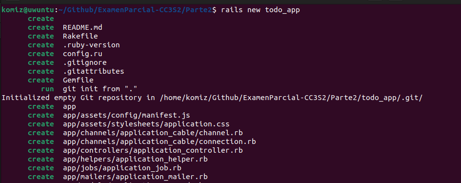
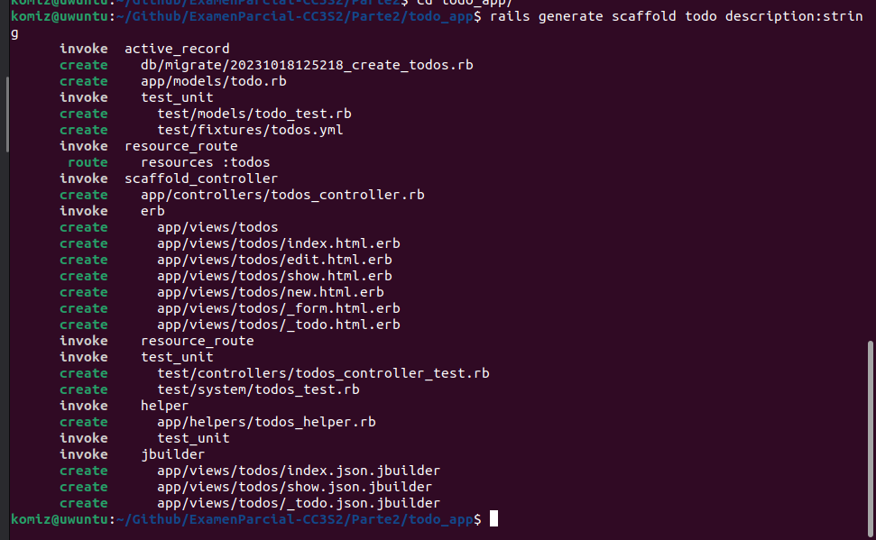
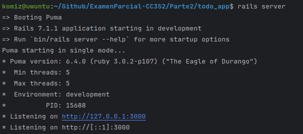
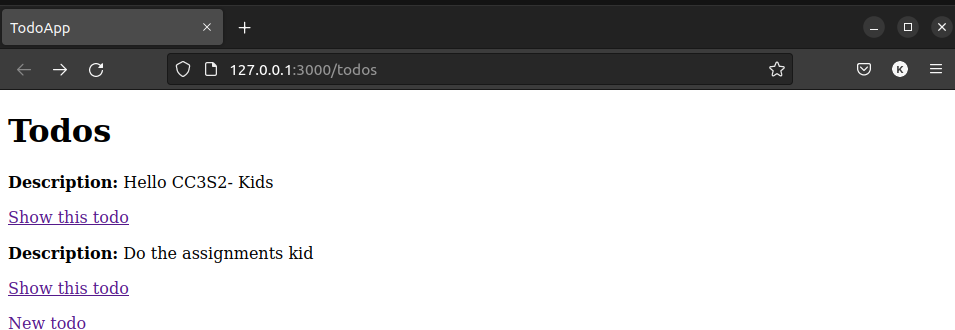
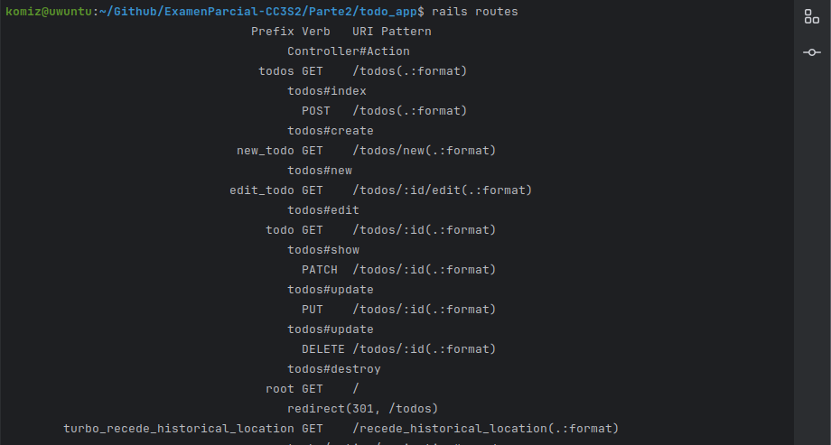

# Parte 2: Introducción a rails

## Iniciando el proyecto
Comenzamos inicializando una aplicación rails con el comando:
rails new todo_app


Luego creamos el recurso utilizando el comando
rails generate scaffold todo description:string


## Base de datos
Ahora realizaremos la conexión entre el modelo y la base de datos utilizando
bundle exec rake db:migrate


Utilizamos el siguiente comando para insertar los datos en la base de datos
rails db:seed

Lanzamos la aplicación utilizando el comando rails server en la consola, pero previo a esto editaremos el archivo config/routes.rb
``` ruby
Rails.application.routes.draw do
  resources :todos
  root :to=>redirect('/todos')
end
```
Le agregamos la línea root ":to=>redirect('/todos')" para redireccionar y poder observar los recursos de la base de datos.

Ahora sí utilizando rails server

Podemos visualizar el resource


Utilizando el comando rails routes podemos observar todas las rutas de la aplicación, siendo las primeras las creadas por el scaffold

