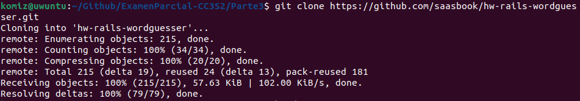
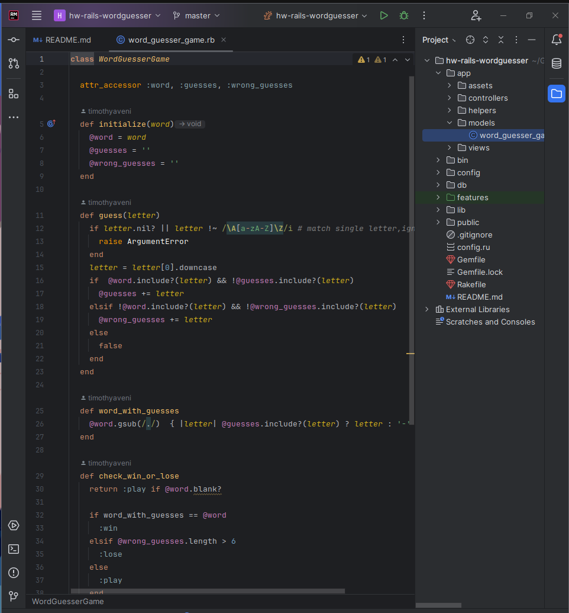
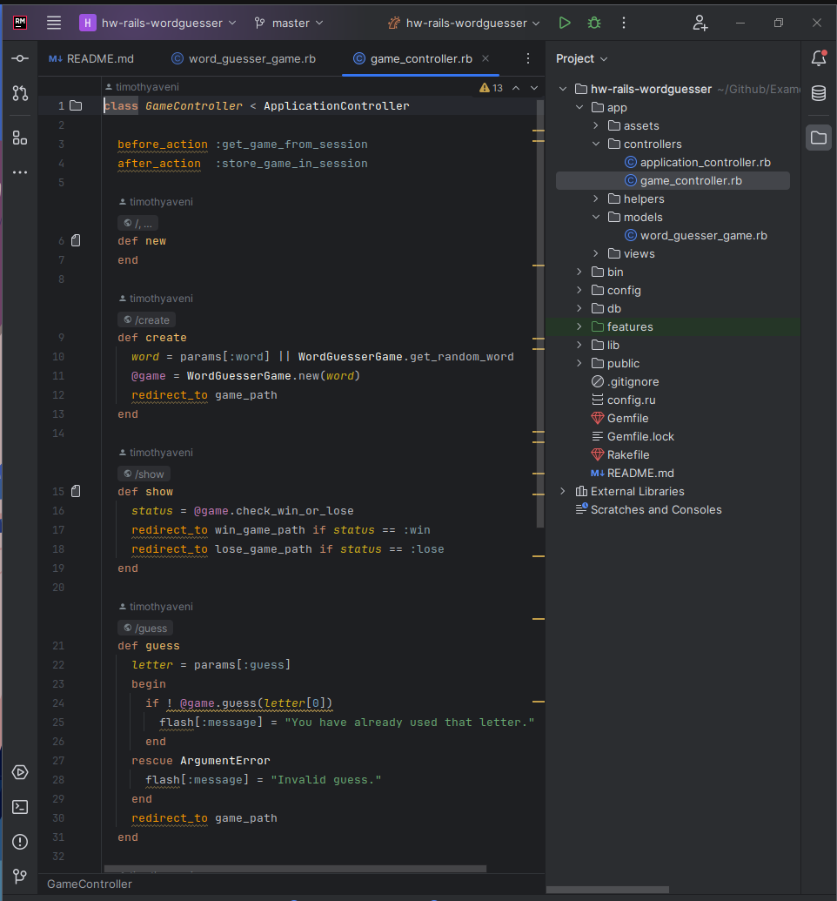

# Parte 3
Iniciamos clonando el repositorio


Para correr el servidor tenemos que utilizar las mismas versiones especificadas en el Gemfile y luego utilizar bundle install


Preguntas
- ¿Cuál es el objetivo de ejecutar bundle install?

Que se instalen las dependencias especificadas en el Gemfile para poder lanzar la aplicación.

- ¿Por qué es una buena práctica especificar --without production al ejecutarlo en su computadora de desarrollo?

Para no instalar las dependencias relacionadas al grupo production epecfificado en el Gemfile, dado que en este mismo tiene dependencias que solo se usarán en ciertas acciones y es especificado.

- ¿En que parte de la estructura del directorio de la aplicación Rails está el código correspondiente al modelo WordGuesserGame?

Se ubica en app/models/word_guesser_game.rb


- ¿En qué archivo está el código que más se corresponde con la lógica del archivo app.rb de las aplicaciones Sinatra que maneja las acciones entrantes del usuario?

En el archivo app/controllers/game_controller.rb


- ¿Qué clase contiene ese código?

La clase ApplicationController que está en el mismo directorio

- ¿De qué otra clase (que es parte del framework Rails) hereda esa clase?

La clase ApplicationController hereda de ActionController::Base el cual e el padre de todas las clases controladoras.
- ¿En qué directorio está el código correspondiente a las vistas de la aplicación Sinatra (new.erb, show.erb, etc.)?

Está en eñ directorio app/views/game.

- Los sufijos de nombre de archivo para estas vistas son diferentes en Rails que en la aplicación Sinatra. ¿Qué información proporciona el sufijo situado más a la derecha del nombre del archivo (por ejemplo: en foobar.abc.xyz, el sufijo .xyz) sobre el contenido del archivo?

En este caso el sufijo es .erb el cual significa "Embedded Ruby" el cual no permite utilizar código embebido ruby.

- ¿Qué información te brinda el otro sufijo sobre lo que se le pide a Rails que haga con el archivo?

El otro sufijo es .html el cual es el utilizado para poder mostrar la vista.

- ¿En qué archivo está la información de la aplicación Rails que asigna rutas (por ejemplo, GET/new) a las acciones del controlador?

En el arcihvo config/routes.rb.

- ¿Cuál es el papel de la opción :as => 'name' en las declaraciones de ruta de config/routes.rb?

El brindarle otro nombre a la ruta para su acceso.

- En la versión de Sinatra, los bloques before do...end y after do...end se utilizan para la gestión de sesiones. ¿Cuál es el equivalente más cercano en esta aplicación Rails y en qué archivo encontramos el código que lo hace?

Lo más cercano en el framework de rails se ubica en el archivo app/controllers/game_controller.rb en las sentencias
``` ruby
before_action :get_game_from_session
after_action  :store_game_in_session
```

- Un formato de serialización popular para intercambiar datos entre aplicaciones web es JSON. ¿Por qué no funcionaría utilizar JSON en lugar de YAML? (Reemplaza YAML.load() con JSON.parse() y .to_yaml con .to_json para realizar esta prueba. Tendrás que borrar las cookies asociadas con localhost:3000 o reiniciar tu navegador con un nuevo Incognito/ Ventana de navegación privada, para borrar la sesión[]. Según los mensajes de error que recibe al intentar utilizar la serialización JSON, debería poder explicar por qué la serialización YAML funciona en este caso pero JSON no).

Esto se debe a que el framework rails ya definió el formato yaml, utilizar otro formato como el json lo que haría sería generar conflictos dentro de la aplicación.


- En la versión de Sinatra, cada acción del controlador termina con redirect (que, como puedes ver, se convierte en redirección_to en Rails) para redirigir al jugador a otra acción, o con erb para representar una vista. ¿Por qué no hay llamadas explícitas correspondientes a erb en la versión Rails?


- En la versión de Sinatra, codificamos directamente un formulario HTML usando la etiqueta <form>, mientras que en la versión de Rails usamos un método Rails form_tag, aunque sería perfectamente legal usar etiquetas HTML <form> sin formato en Rails. ¿Se te ocurre alguna razón por la que Rails podría introducir este "nivel de direccionamiento indirecto"?

- ¿Cómo se manejan los elementos del formulario, como campos de texto y botones, en Rails? (Nuevamente, el HTML sin formato sería legal, pero ¿cuál es la motivación detrás de la forma en que Rails lo hace?)