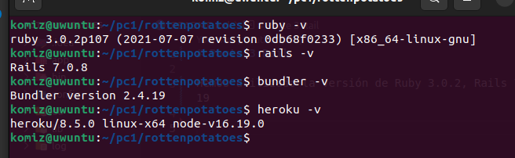
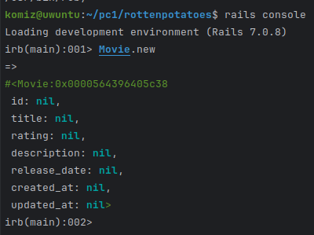
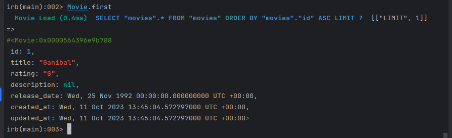
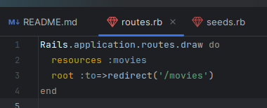
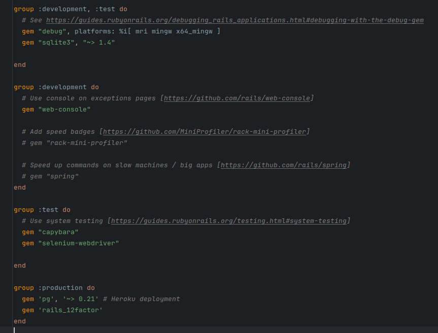
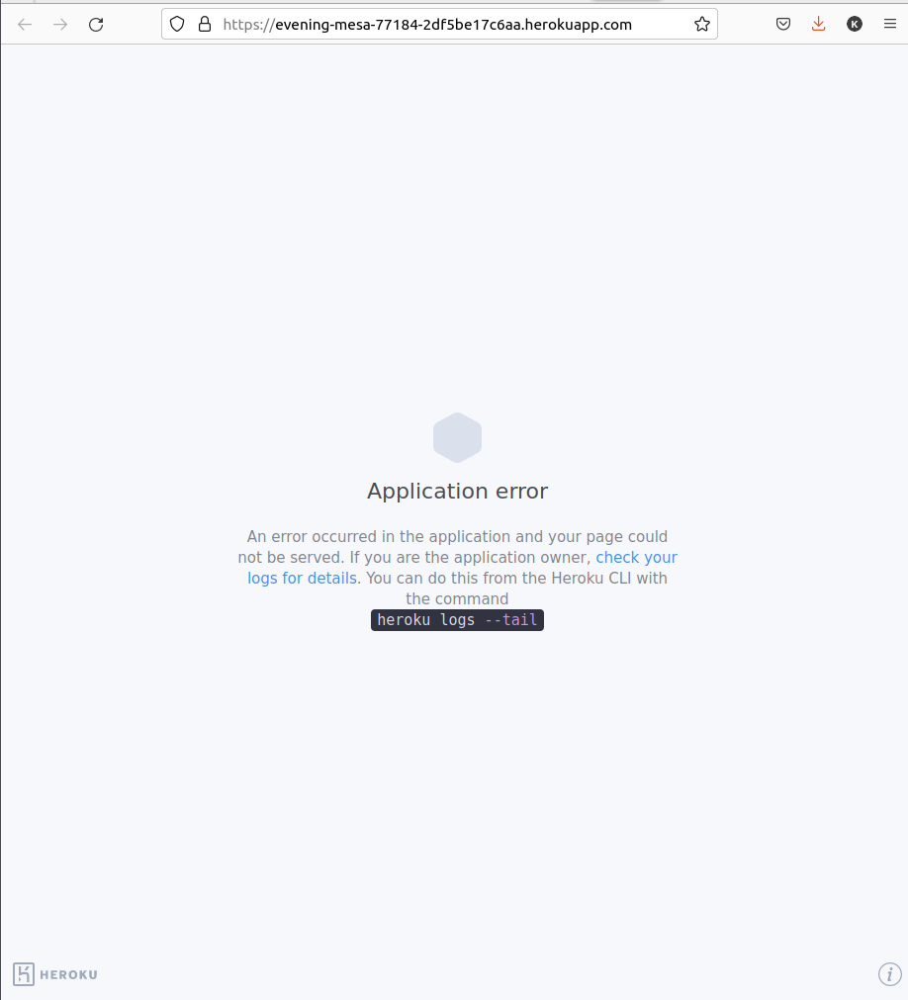
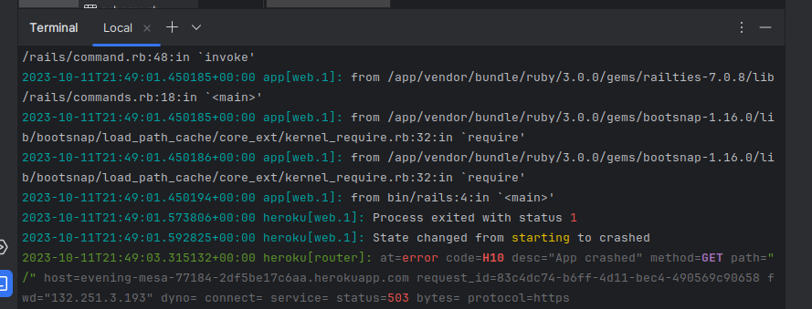

# Parte 3 Rail

Hemos utilizado la versión de Ruby 3.0.2, Rails 7.0.8 y bundler 2.4.19

Utilizamos el comando 
rails new rottenpotatoes --skip-test-unit --skip-turbolinks --skip-spring
Con este comando creamos la aplicación Rails

Finalmente corremos el comando bundle install para instalar las gemas 

Dentro del archivo Gemfile podemos modificar las versiones a usar de las distintas gemas.

Corremos laa aplicación con el comando bin/rails server y podemos ver la aplicación por defecto al crear un proyecto vacío en rails.

Como hemos visto en clase, tenemos bases de datos en diferentes entornos (production, development, yest) los cuales están almacenados en config/database.yml

Vamos a crear y aplicar una migración, el comando a utilizar es
bin/rails generate migration create_movies
El comando lo va a generar en el directorio db/migrate.
El bloque de código dentro del archivo nos indica que se creará una tabla con las columnas título (string), Rating (string), description (string), Release_date (datetime) y timestamps que nos mostrará cuando fue creado y actualizado.
Ejecutamos rails console, y dentro usamos Movies.new

Luego modificamos el archivo seeds.rb

Y al ejecutar el comando Movie.first

En la siguiente parte de la actividad provedemos a configurar el archivo routes.rb del directorio config de la siguiente manera:

Este bloque de código redirecciona la ruta raíz ('/'') hacia la ruta '/movies'.

Ejecutamos el comando:

rails g scaffold_controller Movie title rating description release_date --skip-test

Este comando creará el controlador Movie con los campos title, rating, description, release_date.

Finalmente cambiamos la base de datos para producción, dado que heroku usa postgreSQL, debemos inclir la gema pg. Dado que solo usaremos postgreSQL al momento de lanzar a producción lo colocamos en el grupo de producción. Y el SQLite lo colocamos en el grupo de desarrollo y test.

La aplicación en local nos muestra lo siguiente:

En cambio al lanzar la aplicación a heroku nos muestra el siguiente mensaje

Con el siguiente log

La aplicación está en:
https://evening-mesa-77184-2df5be17c6aa.herokuapp.com/
