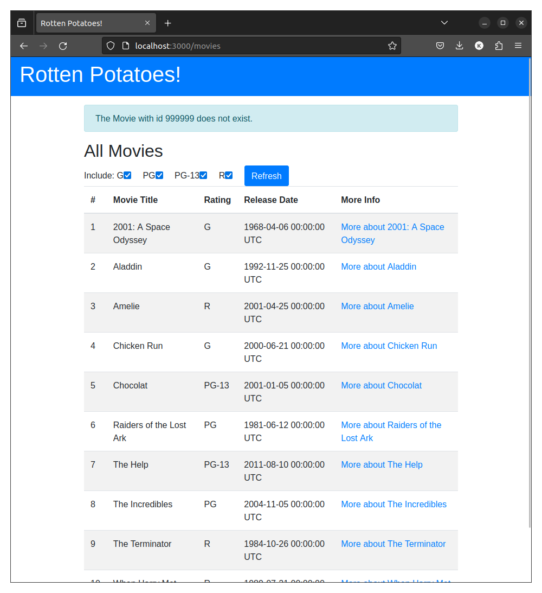
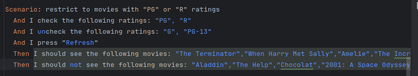
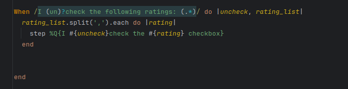
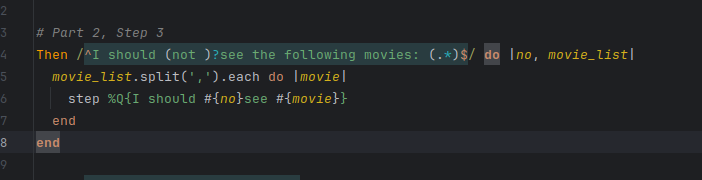
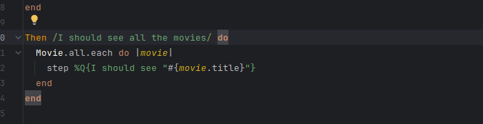
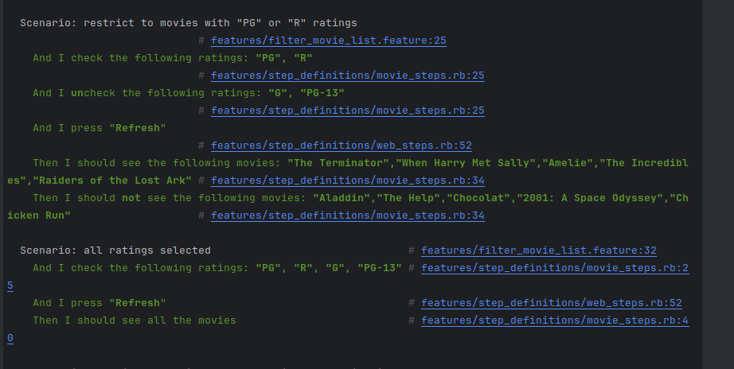
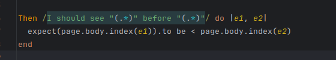
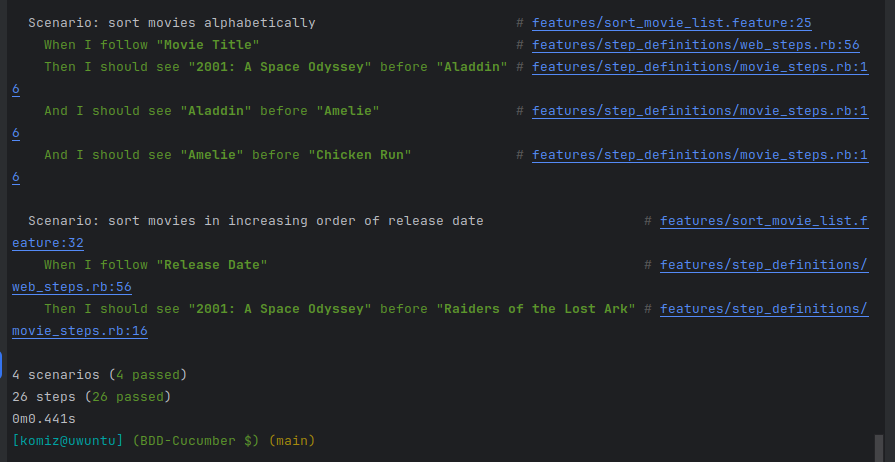

# Pregunta 1

Enunciado:
En las actividades relacionados a la Introducción de Rails los métodos actuales del controlador no son muy robustos: si el usuario introduce de manera manual un URI para ver (Show) una película que no existe (por ejemplo /movies/99999), verás un mensaje de excepción horrible. Modifica el método show del controlador para que, si se pide una película que no existe, el usuario sea redirigido a la vista Index con un mensaje más amigable explicando que no existe ninguna película con ese.

Dentro del repositorio `IntroRuby` vamos a editar el método `show` del script `MoviesController` ubicado en `app/controllers/MoviesController` de la siguiente manera:

```ruby
def show
    id = params[:id] # retrieve movie ID from URI route
    
    begin
        @movie = Movie.find(id) # look up movie by unique ID
    rescue ActiveRecord::RecordNotFound
        flash[:notice] = "The Movie with id #{id} does not exist."
        redirect_to movies_path
    end
end
```

El cual busca una movie por el id, pero si no lo encuentra captura el error y lo redirige al index.



# Pregunta Cucumber

El código se ubica dentro de `BDD-Cucumber/features`
 
1. Completamos el escenario `restrict to movies with PG or R ratings`



2. Definir el paso ` check the following ratings: G, PG, R`



3. Definir el paso `Then I should see the following movies`



4. Definir el paso `Then I should see all the movies`



5. Implementar las definiciones en los escenarios y verificar que funcionan correctamente



6. Definimos el paso `Then I should see "Aladdin" before "Amelie"`



7. Verificamos que funciona correctamente.

